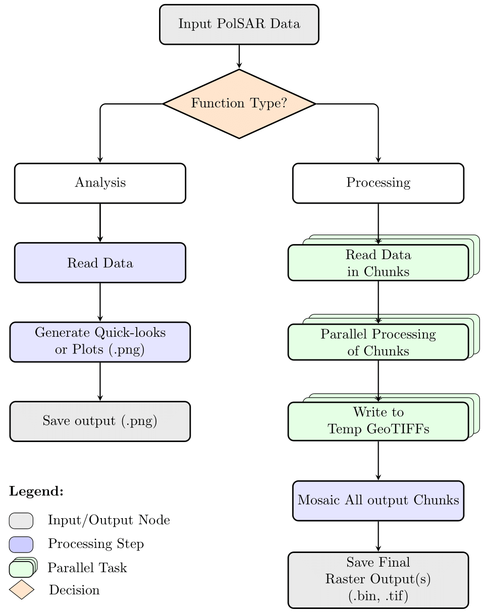

# Summary
Synthetic Aperture Radar has been proven to be more reliable as an earth observation remote sensing technique due to its all-weather and day-night capabilities. Since its initial development and use on an airborne platform seven decades ago, it has significantly evolved in terms of spatial resolution and observing frequencies. It took nearly four decades since then to have a full/quad polarimetric SAR (PolSAR) instrument in space for earth observation [@ulaby1981microwave;@jordan2002sir]. Since then, PolSAR has become a critical data source in a wide variety of earth observation applications [@lee2017polarimetric;@cloude2010polarisation;@van2011synthetic]. On the other hand, there are several operational SAR satellite missions (e.g., Sentinel-1, ALOS-2/4, EOS-04, BIOMASS, etc) that have been collecting and proposed future missions such as NISAR, ROSE-L, that are planned to collect Petabytes of data and distributing openly. For an efficient use of PolSAR data, it is essential to process it and derive interpretable polarimetric parameters to support further downstream applications. 

# Statement of need

With the increasing number of PolSAR missions and openly available datasets due to open data policies, there is an ever increasing demand for processing tools. In addition, the recent migration of PolSAR datasets into cloud-based platforms (E.g. NASA-ESA multi-mission algorithm and analysis platform (MAAP) [@albinet2019joint]) requires processing tools that can be directly used on cloud-based platforms such as [JupyterHub on Kubernetes] (https://z2jh.jupyter.org/en/stable/) and Google colab (https://colab.research.google.com/). There are limited open-source tools available for PolSAR data processing ([PolSARpro](https://earth.esa.int/web/polsarpro/home), [SNAP](https://step.esa.int/main/toolboxes/snap/), and PolSAR tools QGIS plug-in [@bhogapurapu2021polsar]). Although researchers widely use these tools, their direct use cases on a cloud native automatic processing environment are limited due to their primary architecture of a GUI-based approach. There are workarounds to implement these tools using Python wrappers and custom batch scripts. However, setting up automated workflows require significant programming skills, which limits the users. Therefore, the current work developed a native Python package, `polsartools`, for PolSAR data processing, available through Python Package Index ([PyPI](https://pypi.org/)) and [Anaconda Package repository](https://anaconda.org/anaconda/repo). Further, to build upon the vision of [PolSARpro](https://earth.esa.int/web/polsarpro/home), the current package also implements several analysis functions that can be used for a teaching/demonstrating tutorial of polarimetric SAR applications through [Jupyter notebooks](https://github.com/Narayana-Rao/polsartools-tutorials).

A typical polarimetric SAR data processing workflow contains the following steps: 
 - Load data and extract polarimetric matrix (Scattering matrix, [S], Covariance matrix, [$\langle C \rangle$] or Coherence matrix [$\langle T \rangle$]); 
 - A second order [$\langle C \rangle$] or [$\langle T \rangle$] matrix are in general obtained through multi-looking (spatial averaging) single look complex (SLC) elements, [S]
 - Optional speckle filtering
 - Computing derived polarimetric  parameters (decomposition parameters or other descriptors)
 - Analysis of the derived parameters

Based on the above processing steps, the functionalities of `polsartools` package can be broadly categorized into Processing & Analysis. Processing functions generate several SAR polarimetric parameters in a raster format, while analysis functions generate plots and quicklooks from the PolSAR data. \autoref{fig:flowchart} presents the core processing architecture of the `polsartools` package. PolSARtools currently supports several SAR sensors, including spaceborne and airborne sensors. The package designed to support various forms of PolSAR datasets viz. full/quad-, dual-, compact- and hybrid polarimtric.

{width=70%}

<!-- 
# Acknowledgements
The author would like to  -->

# References

